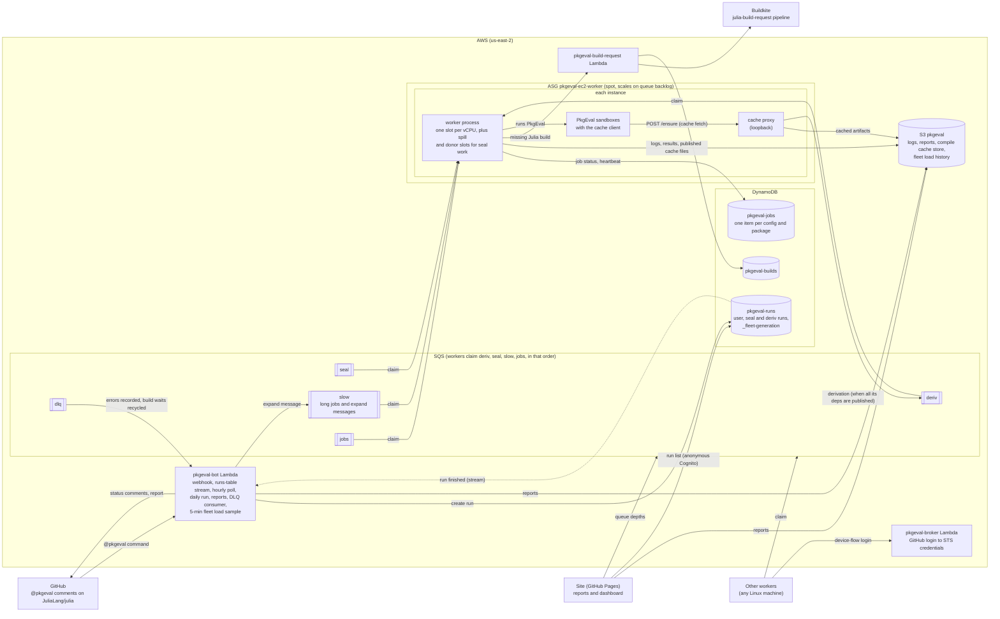
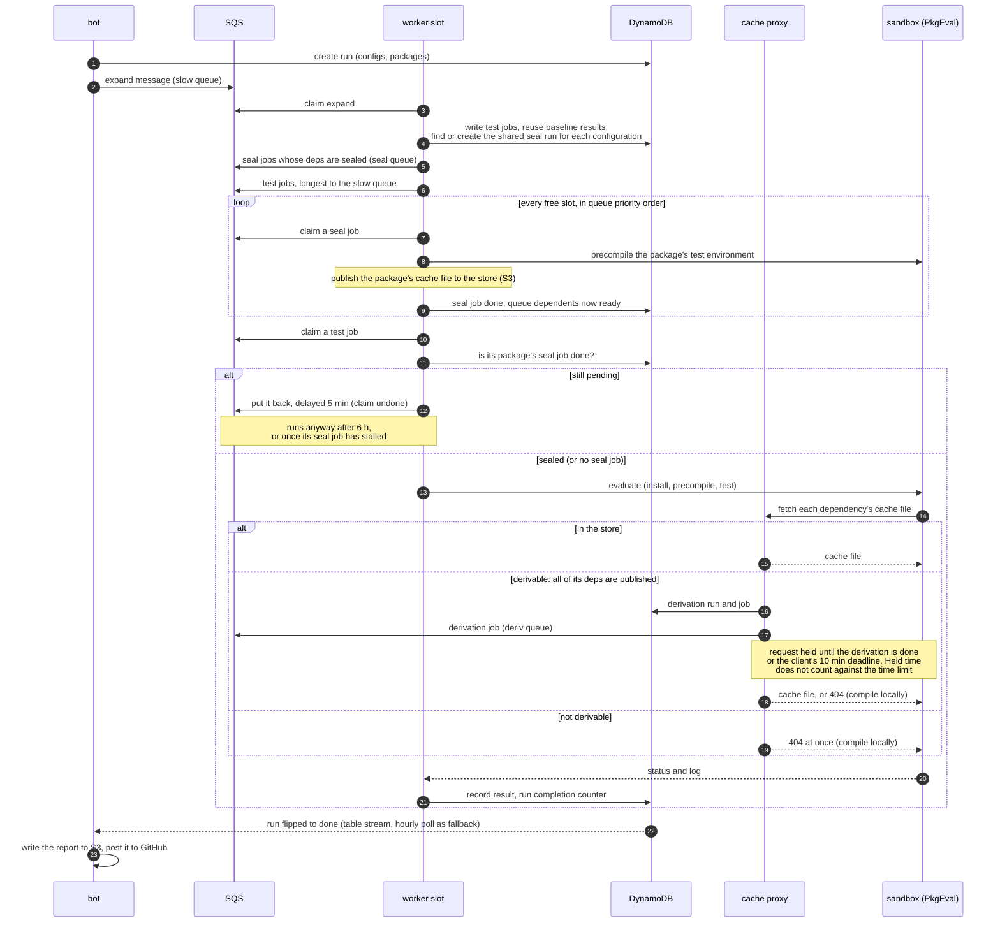

# How the farm fits together

Two views: the pieces and how they talk, then the life of one run. Details of
sealing (the compile cache) are in [sealing.md](sealing.md).

## Components

- **DynamoDB is the source of truth.** SQS only dispatches, and every claim is a
  conditional write on the job item, so duplicate messages are harmless.
- **Workers are stateless.** A worker that dies stops heartbeating, and its jobs
  reappear on the queue. A stopped worker hands its claims back before exiting.
- **The slow queue** takes a run's longest jobs. Workers drain it before the
  fast queue, so short work backfills behind the long jobs and the end of the
  run is not held up by one late straggler.
- **The daily run** replaces Nanosoldier's daily PkgEval: the bot submits it
  and writes a `daily.json` in Nanosoldier's format, which the site reads.
- **Deploys:** pushes to master build the Lambda bundles and the worker
  sysimage (which bakes in PkgEval master as of the build) in CI. Workers boot
  from the commit pinned by the `_fleet-generation` record, which only moves on
  once no worker has kept it alive for 10 minutes, i.e. the fleet has scaled to
  zero. Infrastructure is applied by hand with `tofu apply`; the state lives in
  S3.

## Life of a run

- **Time limit:** about 45 minutes per test, plus up to 30 minutes of held cache
  fetches. Kills at the limit are recorded as `kill`.
- **Retries:** a job whose evaluation fails for infrastructure reasons is handed
  back and retried. The second and later attempts skip the cache and the seal
  gate, and the third records its result whatever it is.
- **Stopping a worker** (spot notice, scale-in, service restart) hands its claims
  back first. Results that finish while it exits are not recorded.
